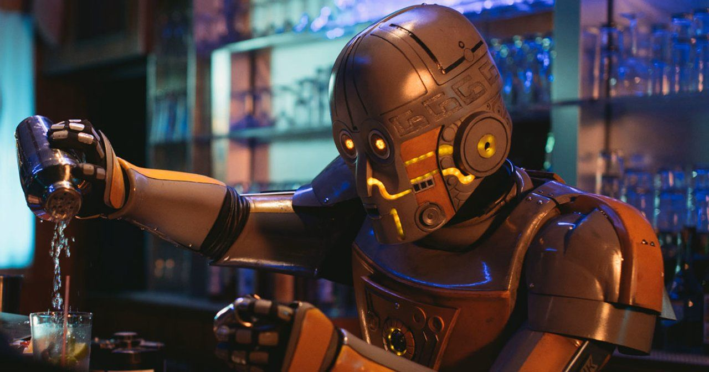

# AI-Mixologist-Project

### Overview
This is a final project of Data Analytisc Bootcamp, the main gole of which is to demonstrate a full stack of obtained skills. 
The subject of this project is creation of new cocktails based on available recipies. Two approaches has been used:
- Generative Adversarial Network (GAN) built in a form of text generator;
- an algorithm, making choices based on frequency assessment and randomisation.
Results of machine learning approach are very poor, mainly due to small size of dataset used, but also probably because the chosen model is not the most suitable for given problem.
In phase 2 of this project the dataset will be increased, as well as other deep learning models will be used.

### Programmic language
Python 3.8.3

### Libraries used
- ipywidgets
- IPython.display
- tkinter
- pandas
- numpy
- nltk
- collections
- random

### Run the program
To run the generative algorithm open file 'GUI' and run it using graphical interface available in this file. The code of the algorithm itself is stored in file 'main'.

### Sources
Dataset: https://www.kaggle.com/ai-first/cocktail-ingredients 
Example of GAN: https://towardsdatascience.com/recurrent-neural-networks-by-example-in-python-ffd204f99470